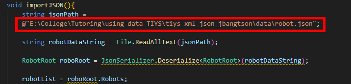
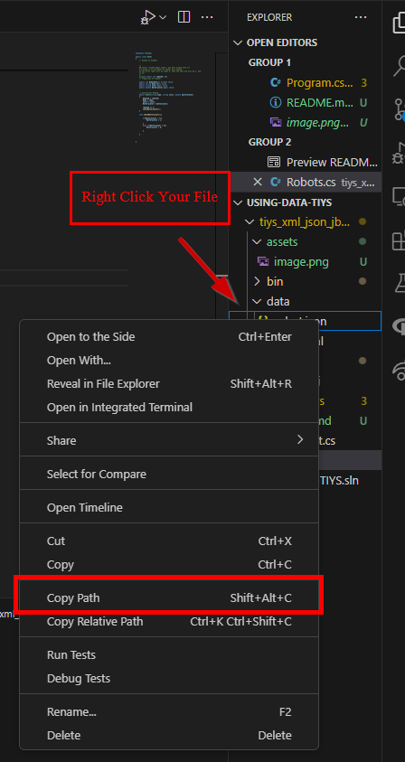

## Introduction

This TIYS is to introduce how to read from XML and JSON files in C#. 

### Set-Up

When you are practicing with this program you will have to change the file paths for both the xml and json files as so:

There is many ways to obtain this file path, but the easiest way I've found is by right-clicking your json or xml file within your file-explorer (to the left or right of your screen) and by selecting 'Copy Path' as so:

### Now, Try It Yourself

When exploring this program, go look at the Robot and RobotRoot classes and how they are used within the main program.

As always, I encourage you to play around with this code to get a feel of how this code works! 